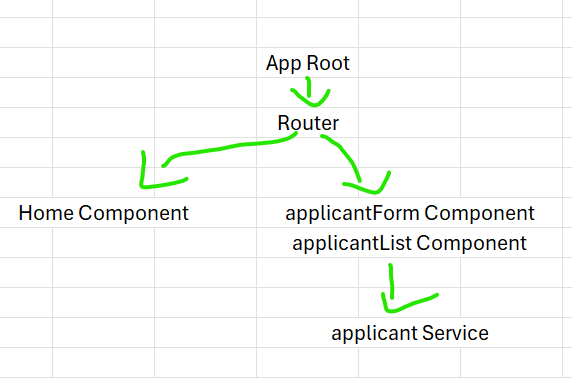

1. ng new abbsApplicants --no-standalone (Because I am using angular 17, So I add in --no-standalone)
2. ng generate module home
3. ng generate component home --module=home
4. ng generate module applicant
5. ng generate component applicant-form --module=applicant
6. ng generate component applicant-list --module=applicant
7. ng generate service applicant/applicant (I created the service called applicant inside the applicant module.)
8. ng generate i models/applicant (I created the interface called applicant inside the models folder.)

- Any new module created needs to be added to app.module.ts.
- I modified the URL link inside the app-routing.module.ts.
- For the home folder, you can think of it as home or header as well.
- I created the CRUD functions/methods inside applicant.service.ts so that I can use them in the applicant-form and applicant-list components.

